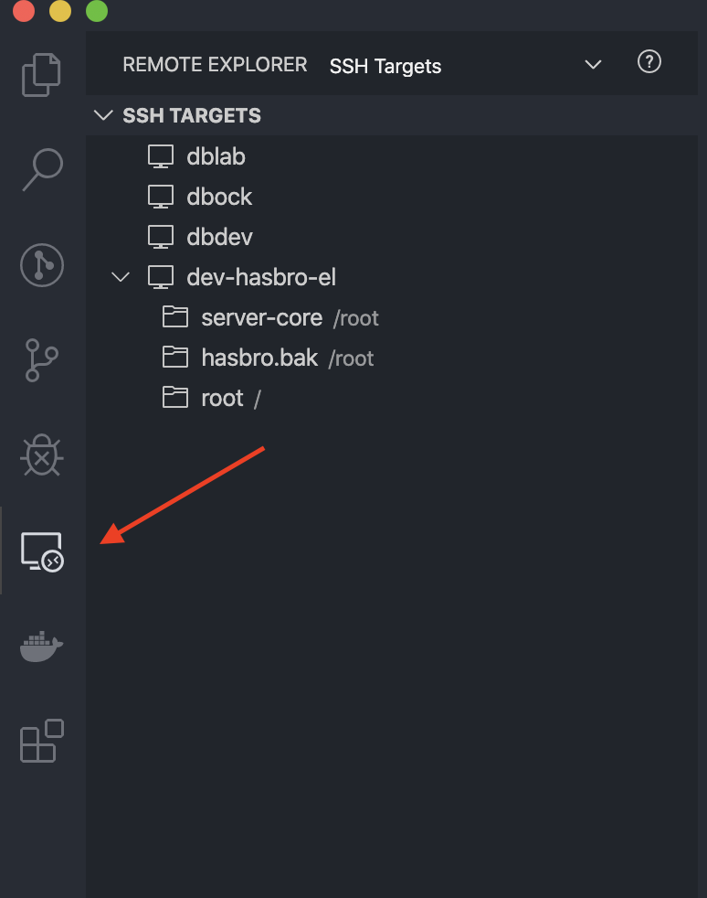
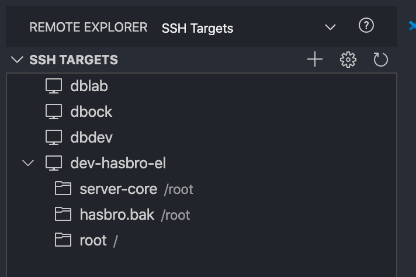
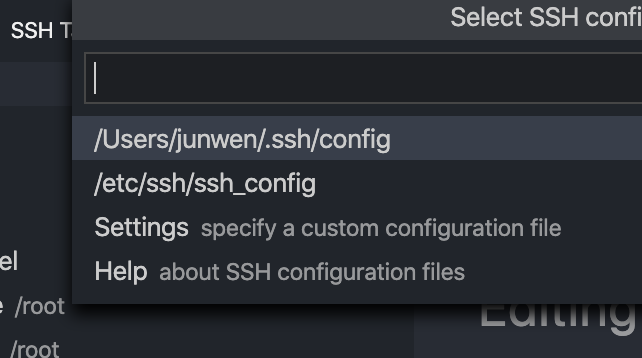
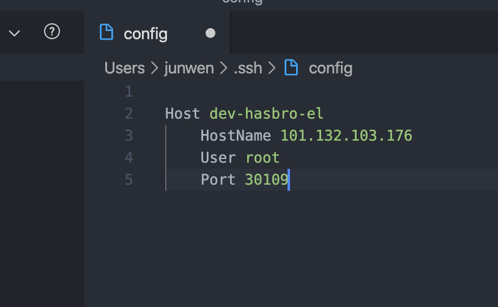

# 从零开始线上开发

本文档详细说明公司线上开发环境以及流程

---

## 基础线上服务一览

| 服务名称                              | 地址                                                         |
| ------------------------------------- | ------------------------------------------------------------ |
| Gitlab                                | [http://git.digital-boundary.com](http://git.digital-boundary.com/) |
| FTP文件服务器/账号admin/密码 db_niubi | http://39.99.144.119:30068/                                  |
| 公司项目知识分享讨论OneNote           | MicroSoft OneNote                                            |
| 公司项目进度管理                      | https://www.leangoo.com/kanban/board_list                    |
| 集群控制台系统/ admin/DB_NIUBI        | https://39.99.144.119                                        |

---

## 搭建线上环境

详细搭建线上环境带图文说明的 可以去FTP服务器下载说明文档路径[/线上开发系统说明/]

这里简要说明一下步骤，登录 https://39.99.144.119  账号admin 密码 DB_NIUBI

选择导航栏 Global --> (clusters) db-dev --> (projects in cluster) db-dev

选择右上角Deploy 创建一个新的实例（线上虚拟机）。

**Name** ： 你的虚拟机名称 遵循[用户-项目-用途] 例如 junwen-hasbro-dev-server

**Docker image**: 系统版本 例如 ubuntu:18.04 （按照实际需求来）后端服务必须使用ubuntu:18.04

**Namespace**： 默认dev

**Port** 端口映射开3个 （具体根据实际需求来，后端服务一般就要3个）

http 80         虚拟机内部端口 <--------> 实际外部访问端口 Random 随机生成

ssh 22          虚拟机内部端口 <--------> 实际外部访问端口 Random 随机生成

api 8000      虚拟机内部端口 <--------> 实际外部访问端口 Random 随机生成

**NodecScheduling**:  选择虚拟机部署的实际线上服务器位置

这里选(划重点)

> Run **all** pods for this workload on a specific node

⚠️ 我们有3台 但是开发项目的机器 必须只能选 izuf6cm3r1qylc7klwv0pzz 不要选错！选错了以后就完蛋了

**Volumes**：选择外挂盘 这里选择把虚拟机的/root/ 映射到外面去方便以后访问（即使虚拟机挂了，开发项目文件还能拿出来）

选择Bind-Mount

Path on the Node ： 外挂硬盘路径 /mount/<u>junwen-hasbro-dev-server</u>   下划线处放你自己的虚拟机名称

The Path on the Node Must be ：选择 如果不存在就建立

> A directory, or create if it does not exist

Mount Point*

写 /root/ 也就是虚拟机的内部被映射出去的路径


接下来最后一步，选择 右下角有个 show advance option

在Networking 选项里DNS Name Server IP Addresses

Add Name Server  这里常见的几个， 只能加3个 建议选阿里的

(G)  谷歌DNS：8.8.8.8

(A)  阿里DNS：223.5.5.5

(T)  腾讯DNS：119.29.29.29

最后点击lunch/save 就创建了一个虚拟机了

---

## 建立虚拟机开发环境

虚拟机建立好了，首先不要急，这个纯环境你是无法从外部直接登录访问的，我们要配置一下才能用起来。

1. 打开terminal 输入

   ```bash
   ssh root@101.132.103.176
   password ccidata^1204
   ```


2. 查找你刚建立的实例

   ```bash
   docker ps
   
   # 找到刚才你起名字的服务
   k8s_junwen-hasbro-dev-server_junwen-hasbro-dev-server
   # 找到相对应的container id
   c32f98150b9a
   # 登录进去
   docker exec -it c32f98150b9a /bin/bash
   # 你就登录进去了显示如下
   root@junwen-hasbro-dev-server-5c99fdfb7b-ffnqm:/# 
   ```

   

3. 配置环境

   ```bash
   apt-get update
   apt-get install -y openssh-server vim git
   vim /etc/apt/sources.list
   # 添加国内源
   deb http://mirrors.aliyun.com/ubuntu/ bionic main restricted universe multiverse
   deb http://mirrors.aliyun.com/ubuntu/ bionic-security main restricted universe multiverse
   deb http://mirrors.aliyun.com/ubuntu/ bionic-updates main restricted universe multiverse
   deb http://mirrors.aliyun.com/ubuntu/ bionic-proposed main restricted universe multiverse
   deb http://mirrors.aliyun.com/ubuntu/ bionic-backports main restricted universe multiverse
   deb-src http://mirrors.aliyun.com/ubuntu/ bionic main restricted universe multiverse
   deb-src http://mirrors.aliyun.com/ubuntu/ bionic-security main restricted universe multiverse
   deb-src http://mirrors.aliyun.com/ubuntu/ bionic-updates main restricted universe multiverse
   deb-src http://mirrors.aliyun.com/ubuntu/ bionic-proposed main restricted universe multiverse
   deb-src http://mirrors.aliyun.com/ubuntu/ bionic-backports main restricted universe multiverse
   
   sudo apt-get update
   ```

   

4. 设置远程登录

   ```bash
   vim /etc/ssh/sshd_config
   #添加 保存退出
   PubkeyAuthentication yes
   # 退出之后重启
   service ssh restart
   
   ssh-keygen -t rsa -C"junwen@hasbro.dev"
   # 一路回车
   # 新建 /root/.ssh/authorized_keys 文件
   # 找到你的自己机器的 cat /root/.ssh/id_rsa.pub 复制你的public key （你自己的路径）
   # 复制添加自己本地的电脑的public key 到 虚拟机系统的/root/.ssh/authorized_keys
   # 再把虚拟机系统的 cat /root/.ssh/id_rsa.pub 出来 复制一下
   
   @! 干掉系统默认路由 不然会卡
   系统会自动添加内部DNS 但是内部没有会增加延迟
   在虚拟机里
   vim /etc/resolv.conf
   注释这个保存退出即可
   # nameserver 10.43.0.10

   @！修改系统时区，不然时间不对
   apt-get install tzdata
   dpkg-reconfigure tzdata
   按照步骤操作即可

   @mysql
   apt-get install -y libmysqlclient-dev libssl-dev
   ln -s /root/hasbro-server/lib/libpython3.7m.so libpython3.7m.so
   ./pip install mysqlclient


   @登录
   http://git.digital-boundary.com/profile/keys
   把key 复制到自己的gitlab setting里
   （如果复制报错，你可能用的windwos系统直接复制，有格式错误，可以剪切到txt文件里，在复制一次，再粘贴过去就好了）
   确定
   这样你就可以直接远程拉项目代码了

   
   # 在虚拟机里
   git config --global user.email "you@example.com"
   git config --global user.name "Your Name"
   
   # 在/root/ 路径下拉取项目(要开发的项目)
   # 后端系统项目先fock 到自己那里再拉项目 不要用原来的
   git clone ssh://git@47.104.88.112:8022/root/server.git
   
   ```

## 通用系统后台框架说明

我们的后台系统目前架构明确，基于我在Django框架下优化自动定义完成，功能强大效率很高

在上一步我们建立了现实虚拟开发环境，现在我们来正式的快速启动服务器，建立远程开发功能（我花了大概一周时间完善这个系统）

1. 刚才我们拉取了我们第一个版本的服务后端框架首先看一下框架目录

   README.md 

   bin	基础命令

   conf   配置文件

   gallant    开发代码的核心地方，盖伦特系统-Django

   html    nginx 代理的前端静态页面的位置，

   include 依赖

   lib  依赖

   logs  日志

   sbin  高级命令

   share 需要的

   source  一些系统需求的插件

   start.sh  开始服务

   ```bash
   # 首先 修改环境变量文件
   conf/env 
   
   找到如下一行 通常在第一个 设置你的项目目录路径，通常在root下 你想在自己环境用 就设置别的
   # setting up your server home 
   export DOMINION_HOME=/root/server
   保存退出
   ```

   ```bash
   # 修改pip 安装的python环境变量
   本框架自带python解析器 不需要单独安装
   
   创建新的python 软链接
   
   ln -s /root/hasbro-server/bin/python3 /usr/local/bin/python(你可以取别的python名称，因为是纯净虚拟环境，唯一指定这个python 即可)
   
   vim /server/bin/pip
   
   找到pip第一行
   #!/root/hasbro/bin/python3.7
   修改为
   #!/root/server/bin/python3.7  (hasbro 替代你自己的项目目录)
   保存退出！
   
   cd server 目录下
   bash start.sh
   
   看看服务是否启动了？顺着我的方法来 绝对没问题
   是不是很方便？
   PS 代码
   ```

   接下来 我们去查看一下系统是否运行正常

   在39.99.144.119平台上 找到你创建的服务器对应的端口8000:31132

   我尝试下来的是这个

   8000:31132

   22:30109

   所以我链接虚拟机的8000端口 实际 就是链接 31132 

   http://101.132.103.176:31132/redoc/
   
   http://101.132.103.176:31132/swagger/
   

## VsCode 远程开发

VSCode 远程无缝链接到虚拟机环境 调试开发比较方便，我们来体验一下

其他功能自己百度

下载Remote development 插件集合包









# 新章节

# nginx

apt-get install -y openssl libssl-dev zlib1g-dev libpcre3 libpcre3-dev
apt-get install libpcre3 libpcre3-dev
apt-get install zlib1g-dev
./configure --prefix=/usr/local/nginx --with-http_stub_status_module --with-http_ssl_module